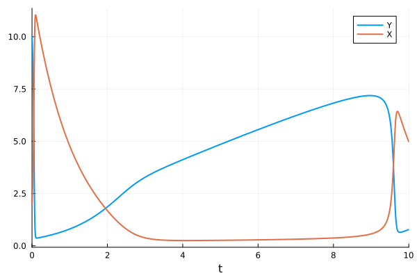

# SBMLImporter.jl
*Julia Importer for Dynamic Models in the SBML Format*

[](https://sebapersson.github.io/SBMLImporter.jl/stable/)
[](https://sebapersson.github.io/SBMLImporter.jl/dev/)
[](https://github.com/sebapersson/SBMLImporter.jl/actions/workflows/CI.yml?query=branch%3Amain)
[](https://github.com/JuliaTesting/Aqua.jl)
[](https://codecov.io/gh/sebapersson/SBMLImporter.jl)

SBMLImporter.jl is an importer for dynamic models defined in the [Systems Biology Markup Language (SBML)](https://sbml.org/). It supports most SBML features, such as events, dynamic compartment sizes, and rate, assignment, and algebraic rules. It imports models as a [Catalyst](https://github.com/SciML/Catalyst.jl) `ReactionSystem`, which can be converted into a `JumpProblem` for Gillespie simulations, a `SDEProblem` for Langevin SDE simulations, or an `ODEProblem` for deterministic simulations. For a detailed list of supported features, see below.

To perform parameter estimation for a SBML model, see [PEtab.jl](https://github.com/sebapersson/PEtab.jl).

A list of differences compared to [SBMLToolkit](https://github.com/SciML/SBMLToolkit.jl) is provided below. For constraint-based modeling, see [COBREXA.jl](https://github.com/LCSB-BioCore/COBREXA.jl).

## Installation

To install SBMLImporter.jl in the Julia REPL enter

```julia
julia> ] add SBMLImporter
```

or alternatively

```julia
julia> using Pkg; Pkg.add("SBMLImporter")
```

SBMLImporter.jl is compatible with Julia version 1.6 and above. For best performance we strongly recommend using the latest Julia version.

## Quick Start

SBML models can be straightforwardly imported using the `load_SBML` function. For example, here we import the [Brusselator](https://en.wikipedia.org/wiki/Brusselator) model (which can be downloaded from [here](https://github.com/sebapersson/SBMLImporter.jl/blob/main/test/Models/brusselator.xml)):

```julia
using SBMLImporter
prnbng, cb = load_SBML(brusselator_SBML_path)
```

This returns two outputs: a `ParsedReactionSystem` (`prnbng`) and a `CallbackSet` (`cb`). The `ParsedReactionSystem` includes the reaction system (`prnbng.rn`), a map for the initial condition values of each specie (`prnbng.u₀`), and a map setting the model parameter values (`prnbng.p`). The `CallbackSet` holds any potential SBML events.

Next, the fields of the `ParsedReactionSystem` structure can be used to create various differential equation problem types. For example, an SDE simulation can be performed using:

```julia
using StochasticDiffEq, Plots
tspan = (0.0, 10.0)
sprob = SDEProblem(prnbng.rn, prnbng.u₀, tspan, prnbng.p)
sol = solve(sprob, LambaEM(); callback=cb)
plot(sol; lw=2)
```


Alternatively, to perform ODE simulations, we instead convert the reaction system (`prnbng.rn`) into an `ODEProblem`:

```julia
using ModelingToolkit, OrdinaryDiffEq, Plots
tspan = (0.0, 10.0)
sys = convert(ODESystem, prnbng.rn)
oprob = ODEProblem(sys, prnbng.u₀, tspan, prnbng.p, jac=true)
sol = solve(oprob, Rodas5(), callback=cb)
plot(sol; lw=2)
```


For more details, see the [documentation](https://sebapersson.github.io/SBMLImporter.jl/stable/).

## Differences compared to SBMLToolkit

The key differences between SBMLToolkit and SBMLImporter are:

* SBMLToolkit works with (and transforms) species to be in amount. SBMLImporter supports species as either amount or concentration.

* SBMLToolkit has a cleaner interface, as it performs all model processing via Symbolics.jl.

* SBMLImporter has wider event support, including events with directionality. It further processes events without species in the trigger into a `DiscreteCallback`, making simulations more efficient.

* SBMLImporter rewrites SBML piecewise expressions to callbacks if possible instead of using `ifelse`, this improves integration stability and reduces runtime.
  
* When possible, SBMLImporter converts reactions to so-called `MassActionJump`s. This greatly improve performance for most Jump simulations.

* SBMLImporter has more extensive SBML support, passing more tests in the test-suite. It is further the SBML importer for PEtab.jl, which regularly tests against several published models of various sizes.

## Supported SBML Features

SBMLImporter supports many SBML features for SBML models (level 2 or higher). Currently, excluding FBA models, it successfully passes 1257 out of 1785 test cases. The failed test cases cover features currently not supported. If SBMLImporter lacks support for a feature you would like, please file an issue on GitHub. Currently unsupported features are:

* Models with empty SBML reactions.
* Delay (creating a delay-differential-equations).
* Events with delay.
* Events with priority.
* Hierarchical models.
* Fast reactions.
* Parameter or species names corresponding to Julia constants (`pi`, `NaN`, `true`, `false`).
* Certain uncommon math expressions, such as `lt` with three arguments, `implies` etc...

Import might also fail for complicated nested piecewise expressions inside SBML functions.

## Citation

We will soon publish a paper you can cite if you found SBMLImporter.jl helpful in your work.
